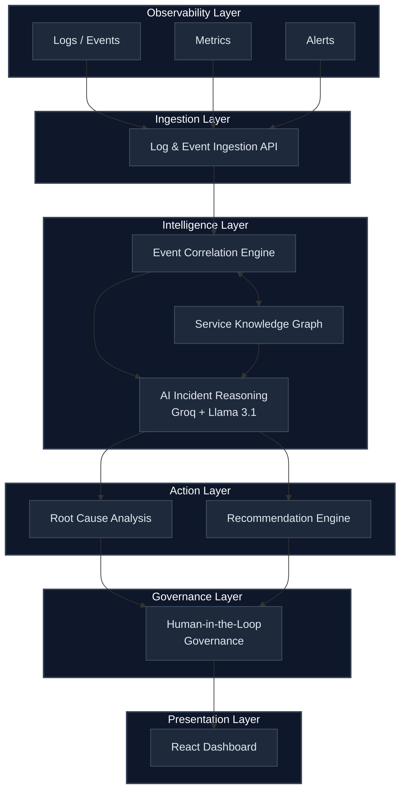

<p align="center">
  <h1 align="center">Devsick</h1>
  <p align="center">
    <strong>AI-Driven Application Support & Operations Platform</strong>
  </p>
  <p align="center">
    An enterprise-grade AI incident reasoning engine that correlates operational signals,<br/>
    identifies root causes, and recommends remediation — with human-in-the-loop governance.
  </p>
  <p align="center">
    
    
    
    
    
  </p>
  <p align="center">
    
    
  </p>
</p>

---

> **Note: This is NOT a chatbot.** Devsick is a structured incident reasoning pipeline — it ingests logs, correlates events, maps service dependencies, and uses AI to generate root cause analysis with actionable remediation playbooks.

---

## Architecture



---

## Key Features

| Feature | Description |
|---------|-------------|
| **Event Correlation** | Groups related errors across services using time windows and dependency mapping |
| **AI Root Cause Analysis** | Llama 3.1 via Groq API generates structured RCA with reasoning chains |
| **Confidence Scoring** | Each analysis includes a confidence score (0–100%) |
| **Remediation Playbooks** | Pre-built action plans with `kubectl` commands and rollback procedures |
| **Human Governance** | Approve/reject workflow — AI never auto-executes on production |
| **Dependency Mapping** | Knowledge graph tracks service relationships and cascade paths |
| **Graceful Degradation** | Falls back to mock RCA when Groq API is unavailable |

---

## Quick Start

### Prerequisites

- Python 3.11+
- Node.js 18+
- Docker (optional)
- Groq API key ([free at console.groq.com](https://console.groq.com))

### Option 3: Production/Server Deployment
If you are deploying to a dedicated Linux server:

```bash
# Clone and enter
git clone https://github.com/yashsrivastava1408/DevSick.git && cd DevSick

# One-click install
./deploy.sh
```

---

## 🏆 Hackathon Guide (For Judges)

To see the true power of **Devsick** during your evaluation, follow these steps:

1. **Protocol Switch**: In the Dashboard, manually toggle from **Protocol Alpha** (Manual) to **Protocol Omega** (Autonomous).
2. **The "Boom" Moment**: Click **Simulate Incidents**. Notice that while critical alerts are flagged for you, the systems **automatically resolves** low-risk errors (like secret refreshes) in real-time.
3. **Traceability**: Click any resolved incident to see the AI's "Reasoning Chain"—it doesn't just fix things, it explains *why*.

---

## Production Deployment & Access
To "insert" Devsick into your enterprise environment, follow these standard practices:

### 1. Networking & Reverse Proxy
For production, we recommend putting Devsick behind **Nginx** or **Traefik**:
- **Port 3000**: Expose for the Frontend UI.
- **Port 8000**: Expose for the Ingestion API.

### 2. Service Access (RBAC)
To allow Devsick to actually execute remediation actions on your server:
- **Kubernetes**: Deploy Devsick with a `ServiceAccount` that has the `ClusterRole` permissions to `get/list/watch` logs and `patch` deployments.
- **Bare Metal**: Provide an SSH key or a `sudoer` service user specifically for Devsick's backend container.

### 3. Log Ingestion
Pipe your server's logs to Devsick using standard collectors:
```bash
# Example: Sending a log via CURL
curl -X POST http://<server-ip>:8000/api/ingest \
     -H "Content-Type: application/json" \
     -d '{"source_service": "auth", "severity": "error", "message": "Connection timeout"}'
```

### Access

| Service | URL |
|---------|-----|
| Dashboard | http://localhost:3000 |
| API Docs (Swagger) | http://localhost:8000/docs |
| Health Check | http://localhost:8000/api/health |

---

## Demo Walkthrough

1. Open `http://localhost:3000`
2. Click **Simulate Incidents** — runs 3 enterprise scenarios
3. Click any incident to see AI reasoning, timeline, and recommendations
4. Use **Approve / Reject** to exercise the governance workflow

### Simulated Scenarios

| Scenario | Root Cause | Cascade Path |
|----------|-----------|--------------|
| **Vault Auth Failure** | Vault sealed/unreachable | Vault → ESO → Database → Auth → API |
| **JWT Key Missing** | JWT signing key lease expired | Vault → Auth → User Service → API |
| **API Auth Cascade** | TLS certificate expired | Cert Manager → API Gateway → Auth → Users |

---

## API Reference

### Core Endpoints

| Method | Endpoint | Description |
|--------|----------|-------------|
| `GET` | `/api/health` | Health check + AI status |
| `POST` | `/api/simulate` | Run all demo scenarios |
| `POST` | `/api/reset` | Clear all data |
| `GET` | `/api/stats` | Dashboard statistics |

### Incident Management

| Method | Endpoint | Description |
|--------|----------|-------------|
| `GET` | `/api/incidents` | List all incidents |
| `GET` | `/api/incidents/{id}` | Get incident details + RCA |
| `POST` | `/api/incidents/{id}/analyze` | Trigger AI analysis |

### Governance

| Method | Endpoint | Description |
|--------|----------|-------------|
| `GET` | `/api/incidents/{id}/actions` | Get remediation actions |
| `GET` | `/api/actions/pending` | List pending approvals |
| `POST` | `/api/actions/{id}/approve` | Approve an action |
| `POST` | `/api/actions/{id}/reject` | Reject an action |

### Infrastructure

| Method | Endpoint | Description |
|--------|----------|-------------|
| `POST` | `/api/ingest` | Ingest a log event |
| `POST` | `/api/ingest/batch` | Batch ingest events |
| `GET` | `/api/graph` | Service dependency graph |
| `GET` | `/api/graph/impact/{id}` | Impact analysis for a service |

---

## Project Structure

```
Devsick/
├── backend/
│   ├── app/
│   │   ├── main.py                 # FastAPI application entry point
│   │   ├── config.py               # Environment & model configuration
│   │   ├── models/                 # Pydantic schemas
│   │   │   ├── events.py           #   Log events, alerts
│   │   │   ├── incidents.py        #   Incidents, RCA, timeline
│   │   │   └── actions.py          #   Remediation actions, approvals
│   │   ├── ingestion/              # Layer 1: Log ingestion
│   │   │   └── log_ingestor.py     #   In-memory event store
│   │   ├── correlation/            # Layer 2: Event correlation
│   │   │   └── engine.py           #   Pattern matching + grouping
│   │   ├── knowledge/              # Layer 3: Service graph
│   │   │   └── dependency_graph.py #   Directed dependency graph
│   │   ├── reasoning/              # Layer 4: AI analysis
│   │   │   ├── ai_engine.py        #   Groq API integration
│   │   │   └── prompts.py          #   Structured SRE prompts
│   │   ├── recommendations/        # Layer 5: Action engine
│   │   │   └── engine.py           #   Remediation playbooks
│   │   ├── governance/             # Layer 6: Human-in-the-loop
│   │   │   └── approval.py         #   Approve/reject state machine
│   │   ├── routes/                 # API endpoints
│   │   └── data/                   # Sample data + service graph
│   ├── requirements.txt
│   └── Dockerfile
├── frontend/
│   ├── src/
│   │   ├── api/client.js           # Backend API client
│   │   ├── components/             # Sidebar, StatusBadge
│   │   └── pages/                  # Dashboard, IncidentPage
│   ├── package.json
│   └── Dockerfile
├── docker-compose.yml
├── .env                            # API keys (gitignored)
└── README.md
```

---

## Configuration

| Variable | Required | Default | Description |
|----------|----------|---------|-------------|
| `GROQ_API_KEY` | No | — | Groq API key for live AI. Falls back to mock if missing. |
| `REACT_APP_API_URL` | No | `http://localhost:8000` | Backend URL for frontend |

---

## Tech Stack

| Layer | Technology | Purpose |
|-------|-----------|---------|
| **API** | Python FastAPI | High-performance async API framework |
| **AI** | Groq + Llama 3.1 8B | Sub-second inference for incident reasoning |
| **Frontend** | React 18 | Enterprise dashboard with dark theme |
| **Validation** | Pydantic v2 | Data models and schema validation |
| **Deployment** | Docker Compose | Multi-container orchestration |
| **Data** | In-memory + JSON | Zero-dependency data layer |

---

## How the AI Works

Devsick uses **structured prompting** — not chat. The AI receives:

1. **System prompt**: SRE persona with specific output schema
2. **Incident context**: Correlated events, service graph, timeline
3. **Output format**: Strict JSON with `root_cause`, `reasoning_chain`, `confidence_score`, `impact_description`

The prompt engineering ensures consistent, auditable RCA output rather than free-form text.

---

## License

This project is built as an enterprise prototype for demonstration purposes.

---

<p align="center">
  <strong>Built by Yash Srivastava</strong>
</p>
