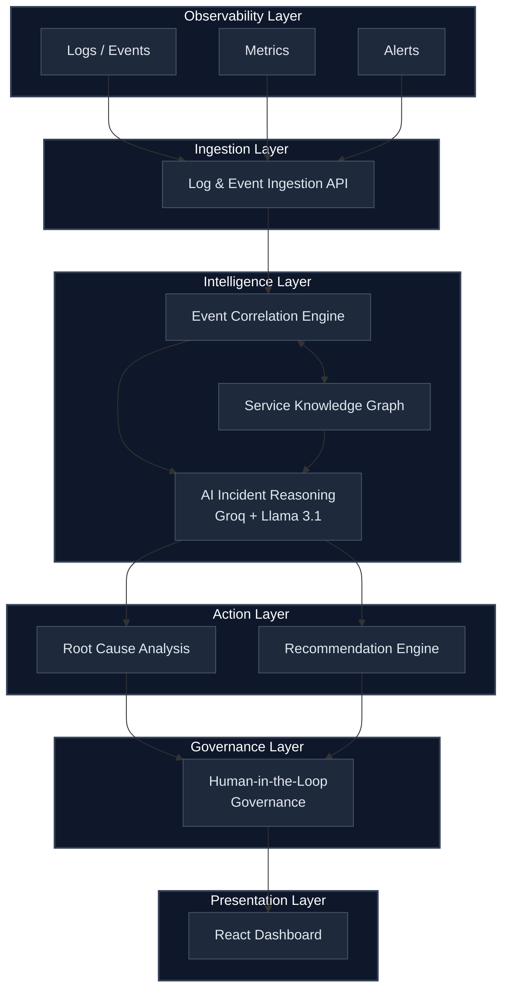

<p align="center">
  <h1 align="center">DEVSICK: PROJECT SENTINEL</h1>
  <p align="center">
    <strong>Autonomous Infrastructure Intelligence & AI Command Center</strong>
  </p>
  <p align="center">
    A premium, cinematic AI incident reasoning engine that correlates operational signals,<br/>
    identifies root causes, and executes autonomous remediation — with human-in-the-loop governance.
  </p>
  <p align="center">
    
    
    
  </p>
  <p align="center">
    
    
  </p>
</p>

---

> **Note: Deployment of Protocol Omega is active.** Devsick is a structured incident reasoning pipeline — it ingests high-velocity logs, correlates events across the service graph, and uses Llama 3.3 to generate autonomous remediation playbooks.

---

## Architecture



---

## Key Features

| Feature | Technical Specification |
|---------|-------------|
| **Cinematic HUD** | 4-corner telemetry grid with real-time system metrics (0.42ms core latency) |
| **Project Sentinel AI** | Llama 3.3 via Groq API generating structured reasoning chains at scale |
| **Obsidian Identity** | Premium Cobalt & Flare aesthetic with liquid scanlines and neural phosphor accents |
| **Autonomous Healing** | Protocol-driven governance allowing for single-click or fully automated resolution |
| **Brutal Typography** | High-impact Syncopate & Space Grotesk hierarchy for maximum technical clarity |
| **Monitoring Stack** | Deep integration with Prometheus & Grafana for mission-critical visibility |

---

## Quick Start

### Prerequisites

- Python 3.11+
- Node.js 18+
- Docker (optional)
- Groq API key ([free at console.groq.com](https://console.groq.com))

### Deployment Options

#### Option 1: Docker Compose (Recommended)
The fastest way to launch the full Sentinel stack:

```bash
# Start all services (Backend, Frontend, Prometheus, Grafana)
docker compose up --build
```

#### Option 2: Local Development
Perfect for rapid feature iteration:

```bash
# Install root dependencies
npm install

# Start both Backend & Frontend concurrently
npm run dev:local
```

#### Option 3: One-Click Cloud Deploy
If you are deploying to a dedicated Linux server:

```bash
# Clone and enter
git clone https://github.com/yashsrivastava1408/DevSick.git && cd DevSick

# One-click install
./deploy.sh
```

---

## Hackathon Guide (For Judges)

To see the true power of **Devsick** during your evaluation, follow these steps:

1. **Protocol Switch**: In the Dashboard, manually toggle from **Protocol Alpha** (Manual) to **Protocol Omega** (Autonomous).
2. **The "Boom" Moment**: Click **Simulate Incidents**. Notice that while critical alerts are flagged for you, the systems **automatically resolves** low-risk errors (like secret refreshes) in real-time.
3. **Traceability**: Click any resolved incident to see the AI's "Reasoning Chain"—it doesn't just fix things, it explains *why*.

---

## Production Deployment & Access
To "insert" Devsick into your enterprise environment, follow these standard practices:

### 1. Networking & Reverse Proxy
For production, we recommend putting Devsick behind **Nginx** or **Traefik**:
- **Port 3000**: Expose for the Frontend UI.
- **Port 8000**: Expose for the Ingestion API.

### 2. Service Access (RBAC)
To allow Devsick to actually execute remediation actions on your server:
- **Kubernetes**: Deploy Devsick with a `ServiceAccount` that has the `ClusterRole` permissions to `get/list/watch` logs and `patch` deployments.
- **Bare Metal**: Provide an SSH key or a `sudoer` service user specifically for Devsick's backend container.

### 3. Log Ingestion
Pipe your server's logs to Devsick using standard collectors:
```bash
# Example: Sending a log via CURL
curl -X POST http://<server-ip>:8000/api/ingest \
     -H "Content-Type: application/json" \
     -d '{"source_service": "auth", "severity": "error", "message": "Connection timeout"}'
```

### Access

| Dashboard | http://localhost:3000 |
| Prometheus | http://localhost:9090 |
| Grafana | http://localhost:3001 |
| API Docs (Swagger) | http://localhost:8000/docs |
| Health Check | http://localhost:8000/api/health |
| Metrics | http://localhost:8000/metrics |

---

## Demo Walkthrough

1. Open `http://localhost:3000`
2. Click **Simulate Incidents** — runs 3 enterprise scenarios
3. Click any incident to see AI reasoning, timeline, and recommendations
4. Use **Approve / Reject** to exercise the governance workflow

### Simulated Scenarios

| Scenario | Root Cause | Cascade Path |
|----------|-----------|--------------|
| **Vault Auth Failure** | Vault sealed/unreachable | Vault → ESO → Database → Auth → API |
| **JWT Key Missing** | JWT signing key lease expired | Vault → Auth → User Service → API |
| **API Auth Cascade** | TLS certificate expired | Cert Manager → API Gateway → Auth → Users |

---

## API Reference

### Core Endpoints

| Method | Endpoint | Description |
|--------|----------|-------------|
| `GET` | `/api/health` | Health check + AI status |
| `POST` | `/api/simulate` | Run all demo scenarios |
| `POST` | `/api/reset` | Clear all data |
| `GET` | `/api/stats` | Dashboard statistics |

### Incident Management

| Method | Endpoint | Description |
|--------|----------|-------------|
| `GET` | `/api/incidents` | List all incidents |
| `GET` | `/api/incidents/{id}` | Get incident details + RCA |
| `POST` | `/api/incidents/{id}/analyze` | Trigger AI analysis |

### Governance

| Method | Endpoint | Description |
|--------|----------|-------------|
| `GET` | `/api/incidents/{id}/actions` | Get remediation actions |
| `GET` | `/api/actions/pending` | List pending approvals |
| `POST` | `/api/actions/{id}/approve` | Approve an action |
| `POST` | `/api/actions/{id}/reject` | Reject an action |

### Infrastructure

| Method | Endpoint | Description |
|--------|----------|-------------|
| `POST` | `/api/ingest` | Ingest a log event |
| `POST` | `/api/ingest/batch` | Batch ingest events |
| `GET` | `/api/graph` | Service dependency graph |
| `GET` | `/api/graph/impact/{id}` | Impact analysis for a service |

---

## Project Structure

```
Devsick/
├── backend/
│   ├── app/
│   │   ├── main.py                 # FastAPI application entry point
│   │   ├── config.py               # Environment & model configuration
│   │   ├── models/                 # Pydantic schemas
│   │   ├── ingestion/              # Layer 1: Log ingestion
│   │   ├── correlation/            # Layer 2: Event correlation
│   │   ├── knowledge/              # Layer 3: Service graph
│   │   ├── reasoning/              # Layer 4: AI analysis
│   │   ├── recommendations/        # Layer 5: Action engine
│   │   ├── governance/             # Layer 6: Human-in-the-loop
│   │   ├── routes/                 # API endpoints
│   │   └── data/                   # Sample data + service graph
│   ├── requirements.txt
│   └── Dockerfile
├── frontend/
│   ├── src/
│   │   ├── api/client.js           # Backend API client
│   │   ├── components/             # Icons, Sidebar, StatusBadge (.jsx) 
│   │   └── pages/                  # Dashboard, IncidentPage, LandingPage (.jsx)
│   ├── public/
│   │   └── background-loop.mp4     # Cinematic background asset
│   ├── package.json
│   └── Dockerfile
├── infrastructure/             # Monitoring Stack
│   ├── prometheus/             #   Prometheus configurations
│   └── grafana/                #   Provisioned Dashboards & DataSources
├── docker-compose.yml          # Multi-container orchestration
├── .env                        # API keys (gitignored)
└── README.md
```

---

## Configuration

| Variable | Required | Default | Description |
|----------|----------|---------|-------------|
| `GROQ_API_KEY` | No | — | Groq API key for live AI. Falls back to mock if missing. |
| `REACT_APP_API_URL` | No | `http://localhost:8000` | Backend URL for frontend |

---

## Tech Stack

| Layer | Technology | Purpose |
|-------|-----------|---------|
| **Branding** | Syncopate + Space Grotesk | Ultra-wide cinematic typography |
| **Inference** | Groq + Llama 3.3 70B | Sub-second incident reasoning & RCA |
| **Visuals** | CSS Glassmorphism + Scanlines | High-contrast technical HUD interface |
| **Backend** | Python FastAPI + SQLModel | High-performance async service layer |
| **Dashboards** | Grafana + Prometheus | Infrastructure monitoring & alerting |

---

## How the AI Works

Devsick uses **structured prompting** — not chat. The AI receives:

1. **System prompt**: SRE persona with specific output schema
2. **Incident context**: Correlated events, service graph, timeline
3. **Output format**: Strict JSON with `root_cause`, `reasoning_chain`, `confidence_score`, `impact_description`

The prompt engineering ensures consistent, auditable RCA output rather than free-form text.

---

## Future Roadmap

To move Devsick from a high-end prototype to an enterprise-grade platform, the following enhancements are planned:

- [ ] **Observability Integration**: Deep integration with Prometheus, Grafana, and Loki for real-time metric analysis.
- [ ] **Enterprise Persistence**: Migration option from SQLite to PostgreSQL for high-availability deployments.
- [ ] **Extended Event Sources**: Native hooks for Kubernetes Event Stream, Argo CD sync failures, and Jenkins pipeline statuses.
- [ ] **Distributed Tracing**: Integration with OpenTelemetry to map requests across microservices.

---

## License

This project is built as an enterprise prototype for demonstration purposes.

---

<p align="center">
  <strong>Built by Yash Srivastava</strong>
</p>
